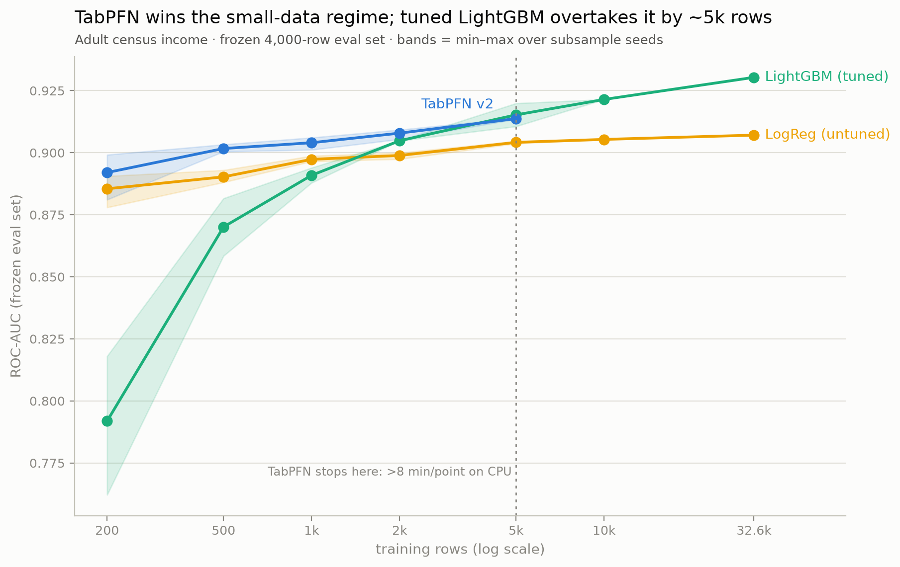
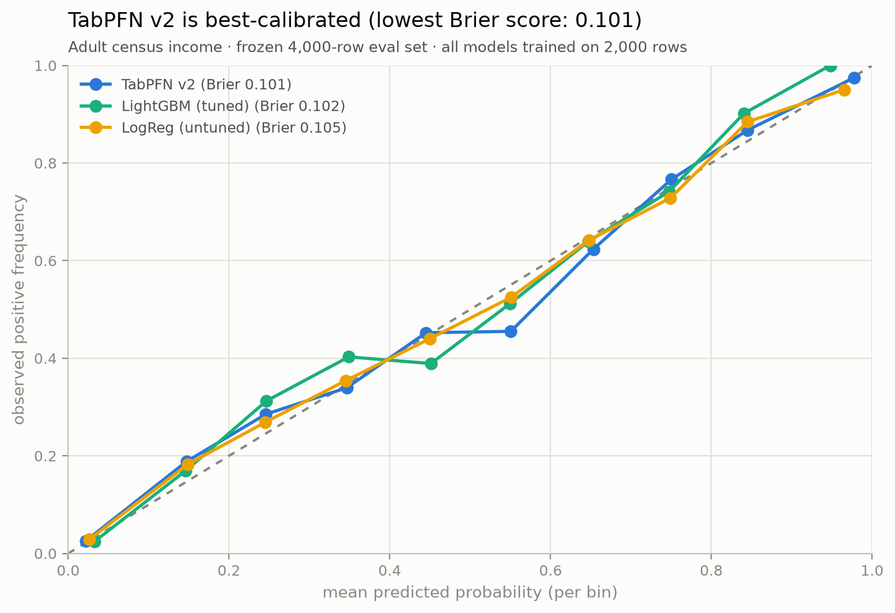
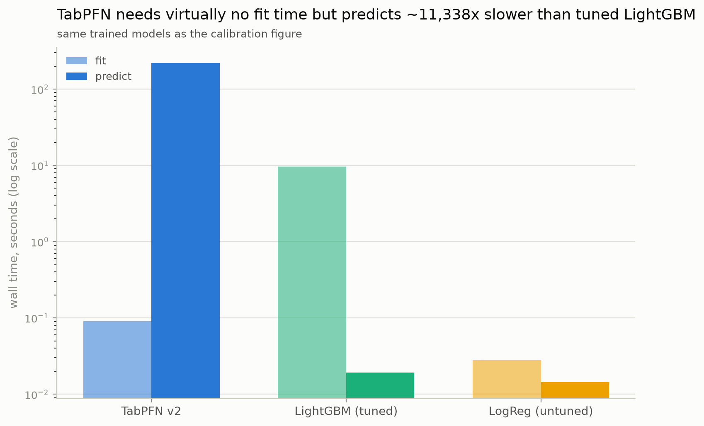
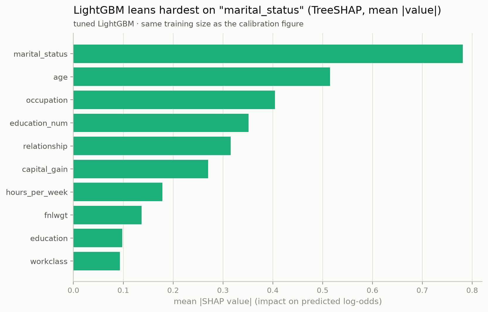
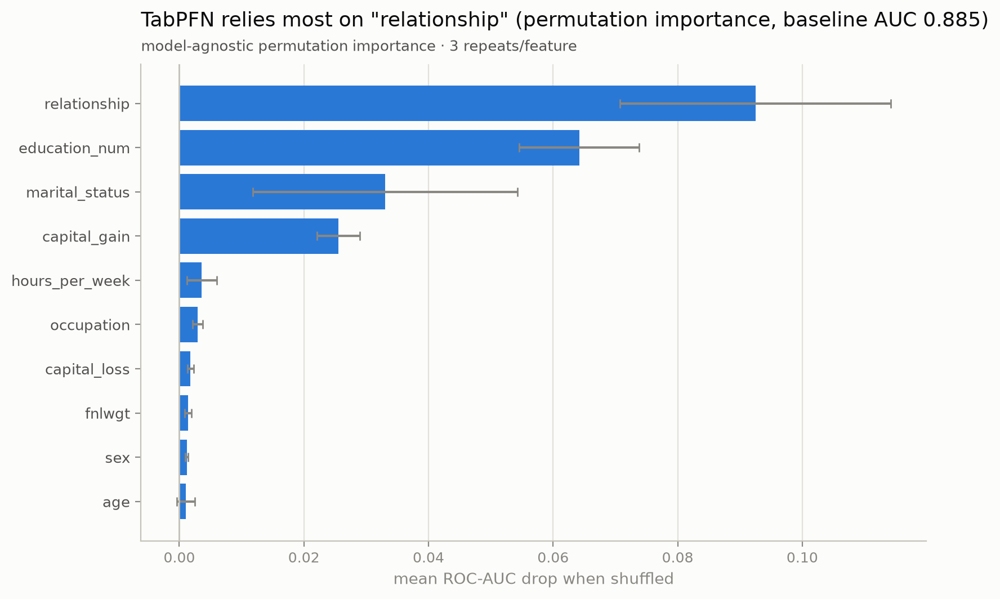

# Tabular Showdown

> When does a model that does **no training** beat a properly tuned GBDT? The
> answer is a curve, not a bragging number.



**TabPFN wins the small-data regime; tuned LightGBM never catches up through
5k rows (the largest we ran TabPFN on CPU).** From
200 to 2,000 training rows, TabPFN beats a freshly Optuna-tuned LightGBM by
a seed-paired, statistically significant margin every time (e.g. at
n=2,000: mean ROC-AUC 0.909 vs. 0.906 across 10 subsample seeds each,
paired 95% CI on the gap excludes 0). At 5,000 rows the race is a
**statistical tie** — the paired 95% CI on the gap (LightGBM − TabPFN)
straddles zero (mean −0.0014, CI [−0.0072, +0.0045], 5 seed pairs; n<6 also
means Wilcoxon can't reach conventional significance here regardless of
effect size, see `results/learning_curve_meta.json`) — and the point
estimate still slightly favors TabPFN (0.9127 vs. 0.9113 mean ROC-AUC).
LightGBM's mean never once overtakes TabPFN's at any size both were
actually run on: there is no measured crossover anywhere from 200 to 5,000
rows, noisy or otherwise. Past 5,000 rows, **TabPFN has no measurements at
all** — an 8-minute-per-point CPU compute valve stops its curve there, not
a capability ceiling — so the one number that looks like a LightGBM win,
its ROC-AUC of 0.930 on the full 32,561-row train set, is an **unpaired,
out-of-range comparison**: nothing about TabPFN was ever measured at that
size, and 32,561 rows sits outside TabPFN v2's own ≤10,000-row
applicability envelope besides (see "Where this sits in 2026" below).

**Per-size significance (TabPFN v2 vs. tuned LightGBM).** Every comparative
claim above rests on a seed-paired test at each training size both models
actually ran on. A **tie** means the paired 95% CI on the ROC-AUC gap
includes 0 (equivalently, the paired *t*-test does not reject at α=0.05); a
**win** means it excludes 0 — see
[Limits](#limits-read-this-before-trusting-a-number-above) for why few-seed,
single-split numbers get the conservative verdict. This table is generated
from `results/learning_curve.csv` by `scripts/make_stats_table.py` — do not
hand-edit it.

<!-- stats-table:start -->
| Train size (n) | Seed pairs | Mean ROC-AUC diff (TabPFN − LightGBM) | 95% CI | Test | Verdict |
|---|---|---|---|---|---|
| 200 | 10 | +0.1000 | [+0.0795, +0.1205] | paired t p<0.001, Wilcoxon p=0.002 | TabPFN wins |
| 500 | 10 | +0.0260 | [+0.0178, +0.0341] | paired t p<0.001, Wilcoxon p=0.002 | TabPFN wins |
| 1,000 | 10 | +0.0125 | [+0.0070, +0.0180] | paired t p<0.001, Wilcoxon p=0.002 | TabPFN wins |
| 2,000 | 10 | +0.0033 | [+0.0013, +0.0053] | paired t p=0.005, Wilcoxon p=0.002 | TabPFN wins |
| 5,000 | 5 | +0.0014 | [−0.0045, +0.0072] | paired t p=0.551, Wilcoxon p=0.625 † | tie |

† At fewer than 6 seed pairs, the Wilcoxon signed-rank test cannot reach p<0.05 however consistent the effect -- its minimum two-sided p-value is 2^(1-n) (0.0625 at n=5) -- so the verdict rests on the paired-t 95% CI, not on the Wilcoxon p. See the Limits section for why few-seed, single-split numbers get the conservative verdict.
<!-- stats-table:end -->

This repo benchmarks **TabPFN v2** ([Hollmann et al., *Nature* 2025](https://www.nature.com/articles/s41586-024-08328-6) — "Accurate predictions on small data with a tabular foundation model"), a prior-data fitted transformer that classifies by in-context learning instead of gradient-based training, against a **tuned LightGBM** (Optuna TPE search) and an **untuned logistic regression** reference, on the UCI Adult / census income dataset. The goal isn't beating a leaderboard — Adult is a "solved" dataset — it's mapping out *where each approach wins* and being honest about the compute cost of each, with a named significance test behind every comparative claim rather than a bare mean-vs-mean headline.

## When to use what

| | **TabPFN v2** | **LightGBM (tuned)** | **LogReg (untuned)** |
|---|---|---|---|
| Best regime here | leads or ties at every size tested, 200–5,000 rows (statistically significant through 2,000; a tie by 5,000) | no significant paired win at any tested size ≤5,000 rows; its one clear lead is the unpaired, out-of-range 32,561-row full-train point | never the best, but nearly ties TabPFN at ≤1,000 rows (see below) — still a fast, interpretable floor everywhere |
| Training cost | ~0s (in-context, no gradient training) | Optuna search + fit, ~1.4s–1,041s per (size, seed) depending heavily on which hyperparameters the search lands on; the separate one-time 30-trial full-train tune took ~2.6min and is reused, not re-run | ~0s |
| Prediction cost | **slow**: ~29–1,220s to score 4,000 rows on CPU, growing steeply with training-set size; never measured above n=5,000 (compute valve, see below) | fast: ~0.005–0.05s to score 4,000 rows, regardless of training size | fast: ~0.01–0.03s |
| Needs tuning? | no (that's the point) | yes (Optuna, 10 trials per subsampled size here, 30 for the full-train baseline) | no (this project never tunes it) |
| Hard caps | ≤10,000-row / ≤500-feature / ≤10-class applicability envelope, per TabArena's characterization of the Nature-2025 model (arXiv 2506.16791); CPU makes it impractically slow well before that ceiling in this repo | none inherent; scales with data | none inherent, but ceiling is lower |
| Calibration (n_train=2,000, single split — differences are within single-split noise, not a ranking) | Brier 0.101, log loss 0.316 | Brier 0.102, log loss 0.319 | Brier 0.105, log loss 0.331 |
| GPU required for real use? | recommended (CPU is viable but slow, see below) | no | no |
| Pick it when... | you have a small/medium labeled set and no time to tune, or need a fast baseline with no training loop | you have thousands+ rows and can afford a tuning pass, and need fast repeated inference | you need an instant, interpretable, zero-dependency floor — or you're not sure a short tuning budget will beat it anyway at small n |

*Every row above is read off a single dataset (Adult) and a single frozen
eval split — see "Limits" below. Treat this table as "what happened on
Adult," not a general model-selection rule.*

**LogReg's honest surprise.** At small training sizes, the untuned
logistic-regression baseline isn't just a floor — it nearly matches TabPFN,
and both comfortably beat LightGBM. At n=200 (10 seeds), LogReg's mean
ROC-AUC is 0.882 against TabPFN's 0.884 (a 0.003 gap) while LightGBM sits
at 0.784 — badly hurt by a 10-trial Optuna budget that isn't enough search
to find good hyperparameters from so few rows. The tabpfn-minus-logreg gap
itself is noisy, not a clean trend: it widens sharply by n=500 (0.010)
before partially retreating (0.007 at n=1,000) and drifting back up
through 2,000–5,000 rows (0.008, 0.009) — read that as sampling noise on
top of a real but small and non-monotonic gap, not a story with a
direction. LightGBM's own tuning starts paying off by 2,000+ rows, where
it overtakes LogReg (0.906 vs. 0.901 at n=2,000). Read the small-n
collapse as a comment on the 10-trial tuning *budget* used everywhere in
this project, not as "LightGBM is bad at small data" — a wider search
would likely close most of this gap; this project never tests that
(REVIEW.md WP-B3, point 1).

## Figures

### Calibration



All three models are well-calibrated on Adult (a well-behaved binary target
helps): Brier scores of 0.101 (TabPFN), 0.102 (LightGBM), 0.105 (LogReg),
and log loss of 0.316, 0.319, 0.331 respectively — TabPFN edges out the
other two by a hair, but on a single 4,000-row split these differences are
within noise, not a real ranking. LightGBM used to look meaningfully
worse-calibrated here (Brier 0.109), but that number came from reusing the
full-train-tuned hyperparameters at a size they were never tuned for
(REVIEW.md WP-B2) — a mis-tuned configuration, not an honest one. LightGBM
in this figure is now tuned fresh at n_train=2,000 with the same
10-trial/3-fold recipe used everywhere else in this project, and most of
the old calibration gap turns out to have been a tuning artifact, not a
real difference between trees and in-context learning.

Zooming out from this single split to the mean across all curve seeds
(`learning_curve.csv`'s own `brier`/`log_loss` columns) shows exactly why
a one-metric calibration story is fragile: **mean Brier flips sign between
n=2,000 and n=5,000** — TabPFN ahead at 2,000 (0.0996 vs. LightGBM's
0.1012), LightGBM narrowly ahead at 5,000 (0.0973 vs. TabPFN's 0.0975) —
**but mean log loss does not flip**; TabPFN stays lower at both sizes
(0.3109 vs. 0.3185 at 2,000; 0.3046 vs. 0.3074 at 5,000). Brier and log
loss don't have to agree, and here they don't: pick one scoring rule and
you can tell either story.

### Prediction-time cost



The honest compute-cost story: TabPFN's fit is a rounding error (it just
stores the training set as context) but its predict is the bottleneck —
about four orders of magnitude slower than LightGBM's predict at the same
training size. LightGBM inverts the trade-off: it pays for a tuning search
up front, then predicts almost instantly, however large the training set.
Neither is "faster" in general — it depends whether your workload is
train-once/predict-many (favors LightGBM) or predict-once-per-cold-start
(favors TabPFN, if you can tolerate the per-call latency).

### What each model leans on

<table>
<tr>
<td></td>
<td></td>
</tr>
</table>

Two different tools for two different model architectures, on purpose:
**TreeSHAP** is exact for LightGBM because it's a tree ensemble — the
attribution can be read straight off the trees. **TabPFN has no native
feature importances** (it's an in-context transformer, not a tree), so the
honest substitute is **model-agnostic permutation importance**: shuffle one
feature at a time in the eval set and measure the ROC-AUC drop. Both models
converge on a similar theme (marital/relationship status and
education/occupation drive Adult's income label most), which is itself a
useful cross-check that both are learning something sensible rather than
memorizing noise.

## Reproduce

```bash
uv sync

# M1-M4: data pipeline, tuned LightGBM baseline, TabPFN, the money chart
uv run python scripts/run_lgbm_baseline.py     # -> results/lgbm_baseline.json (~3 min)
uv run python scripts/run_curve.py             # -> results/learning_curve.csv (~50 min for the original 1-3-seed sweep; the 10/5-seed expansion (Task B4) added several more hours across resumed, appended invocations — it resumes via skip-keys, safe to re-launch)
uv run python scripts/plot_curve.py            # -> results/learning_curve.{png,svg}

# M5: calibration, SHAP, permutation importance
uv run python scripts/make_figures.py          # -> results/figures/*.{png,svg} (~5-10 min, CPU; the single TabPFN predict alone can hit ~5.5 min under contention)

# M6: the Streamlit demo
uv run streamlit run app.py

# gate
uv run pytest -q
uv run ruff check .
```

Every step above reads the artifacts from the previous one (`results/*.json`,
`results/*.csv`) rather than re-deriving them, so any single script can be
re-run in isolation once the earlier artifacts exist. `results/` and
`results/figures/` are committed so `plot_curve.py`, `make_figures.py`, and
`app.py` are all reproducible/inspectable without re-running the slow steps.

## Method notes

- **Frozen eval set**: every number in this project — every curve point,
  every calibration/SHAP/permutation figure — is scored on the same fixed,
  stratified 4,000-row subsample of `adult.test` (seed 42). This is what
  makes the comparisons across models and training sizes fair; it also
  means every reported metric is a single split, not a cross-validated
  estimate.
- **The learning-size curve** sweeps training-set size ∈ {200, 500, 1k, 2k,
  5k, 10k, full (32,561)}: **10 subsample seeds** at every size ≤2,000,
  **5 seeds** at 5,000 and 10,000 (TabPFN never runs at 10,000 or full-train
  — see Limits), and 1 seed at the full-train point. LightGBM is freshly
  Optuna-tuned (10 trials, 3-fold CV) at every subsampled (size, seed) pair
  — a fresh search per point, not shared across seeds; the full-train point
  instead reuses the 30-trial baseline tune from `results/lgbm_baseline.json`.
  LogReg is never tuned, anywhere. `run_curve.py` also computes, per size,
  each model's mean/std/min/max ROC-AUC across seeds and a seed-paired
  TabPFN-vs-LightGBM significance test (paired t-test + Wilcoxon
  signed-rank, "tie" by default unless the 95% CI excludes 0) into
  `results/learning_curve_meta.json` — see `tabular_showdown.stats` and
  REVIEW.md WP-B1 for why a tie is the default verdict, not whichever mean
  happens to be larger.
- **Calibration + SHAP figures** (`results/figures/calibration.png`,
  `shap_summary.png`) train all three models fresh at **n_train=2,000**
  (seed 0) — the largest size where a single TabPFN predict on the full
  4,000-row eval set stays a few minutes on CPU (measured ~216–328s across
  the curve's 10 seeds at this size; CPU contention from other jobs can
  push a single live run higher still). LightGBM is
  freshly Optuna-tuned at this size too (10 trials, 3-fold CV, the same
  recipe `run_curve.py` uses) rather than reusing the full-train-tuned
  baseline — it used to reuse those params, which made the calibration
  comparison a mis-tuned one (REVIEW.md WP-B2); see `figures_meta.json`'s
  `calibration_shap.lgbm_params_source` for the current provenance.
- **TabPFN permutation importance** (`permutation_importance.png`) runs at
  a *separately reduced* n_train=200 with a 200-row eval subsample and 3
  repeats/feature. Permutation importance costs `1 + features × repeats`
  predict calls (43 here); at the n=2,000 calibration size that would be
  ~2.5 hours of TabPFN predicts on CPU. At n=200 it's a few minutes. This
  is honestly a smaller/rougher TabPFN fit than the calibration one — see
  `results/figures/figures_meta.json` for the exact sizes and seeds of
  every figure.
- **Timing figure** reuses the wall-clock times already recorded by the
  learning-size curve run at n_train=2,000 rather than re-measuring, since
  those numbers include the real cost of a freshly-tuned LightGBM at that
  size (a 10-trial Optuna search), which is the more honest "tuned-fit"
  story than timing a fit with pre-tuned params.

## Limits (read this before trusting a number above)

- **TabPFN is capped at n=5,000 here by an 8-minute-per-point CPU compute
  valve**, not by TabPFN v2's own ~10,000-row pretraining limit. The curve
  run skips any larger TabPFN size once one point exceeds the time budget
  — n=10,000 was never attempted for TabPFN (LightGBM and LogReg did run
  there; see `results/learning_curve.csv`). Don't read "TabPFN's line stops at 5k"
  as "TabPFN can't handle more than 5k rows"; it can, per the paper, up to
  ~10k rows / ~500 features (TabArena, arXiv 2506.16791, puts TabPFNv2's
  own stated applicability envelope at ≤10,000 rows / ≤500 features / ≤10
  classes) — this repo just never gave it a GPU to do so quickly. That also
  means the full-train comparison point (32,561 rows) is outside TabPFN's
  envelope on rows alone, quite apart from never having been measured — see
  "Where this sits in 2026" below. `ignore_pretraining_limits=True` is
  required to even run TabPFN above 1,000 rows on CPU with this library
  version (2.0.9); it overrides a performance guard, not a hard capability
  ceiling.
- **Adult is a "solved" dataset.** The full-train and large-n points land
  in the same 0.88–0.93 ROC-AUC band that's been published dozens of times.
  Small-n LightGBM is the exception, not the rule: its 10-trial-tuning
  collapse (see "LogReg's honest surprise" above) pulls it as low as 0.747
  at n=200 across the 10 seeds — well below the "solved" band, and below
  TabPFN's (0.850) and LogReg's (0.868) own floors at that size. The point
  of this repo is the *comparison method* — the learning-size curve,
  calibration, timing, and explanation methodology — not a SOTA accuracy
  claim.
- **Single frozen eval set, no cross-validation.** Every metric in every
  figure and in the app is one split. Treat differences smaller than the
  curve's seed-to-seed band (the shaded region in the money chart) as
  noise, not signal.
- **LogReg is deliberately untuned** — it's a floor/sanity-check reference,
  not a competitor. Don't read its numbers as "what logistic regression can
  achieve"; a tuned LogReg would do better.
- **AutoGluon was planned (see `PLAN.md`) but is deferred**, not
  implemented. The three-way comparison here is TabPFN v2 vs. tuned
  LightGBM vs. untuned LogReg only.
- **CSV upload in the Streamlit app is intentionally disabled** for
  anything other than the built-in Adult dataset — the tuned LightGBM
  hyperparameters and TabPFN's categorical encoding are fitted to Adult's
  specific 14-column schema, and generalizing the pipeline to arbitrary
  uploads was out of scope (YAGNI) for this demo.

## Where this sits in 2026

TabPFN v2 is not the newest tabular foundation model anymore, and this repo
is not trying to be a new leaderboard entry — it's an honest, small-scale
replication of a story the field has already told at much larger scale.

- **The `tabpfn==2.0.9` pin is deliberate, not inertia.** TabPFN-2.5
  (Nov 2025, arXiv 2511.08667), TabPFN-2.6, and TabPFN-3 all exist, scale
  to far more rows/features, and reportedly close more of the gap to tuned
  ensembles. But their weights ship under a **non-commercial license**
  requiring a Prior Labs account/token — a real licensing tightening
  relative to TabPFN v2, whose weights are Apache-2.0-with-attribution and
  download without logging in anywhere. This repo picked "freely
  runnable" over "newest."
- **TabPFN v2's own stated applicability envelope is ≤10,000 training
  rows, ≤500 features, ≤10 classes** (per TabArena, arXiv 2506.16791) —
  "within that, it outperforms by a large margin." Adult's full 32,561-row
  train set is roughly 3x over the row limit. The full-train LightGBM
  point in this repo's money chart (ROC-AUC 0.930) is a real, honestly
  reported number, but it was never a fair fight for TabPFN to lose —
  TabPFN was never run there, by cap and by its own design envelope both.
- **TabArena** (arXiv 2506.16791, NeurIPS 2025 Datasets & Benchmarks
  Spotlight) is the field's living benchmark: 51 datasets, repeated
  resampling (10x repeated 3-fold CV under 2,500 rows, 3 repeats above),
  8-fold inner CV for tuning — far more statistical power than this
  repo's single dataset and 5–10 seeds. Its 2026 leaderboard has
  foundation models (TabPFN-3, TabPFN-2.6, TabICLv2, ...) on top, with
  wins concentrated on **smaller** datasets and GBDTs catching up/winning
  as size and categorical-feature share grow — directionally the same
  shape this repo's own curve shows, at a much smaller scale and with much
  less evidence per point.
- **This repo follows the 2026 statistical-rigor norm rather than
  inventing its own**: "Position: SOTA Claims Require SOTA Evidence"
  (arXiv 2605.17273) argues that a "win" claim needs a named significance
  test and defaults to "tie" otherwise, naming single/two-seed comparisons
  as malpractice. `tabular_showdown.stats.paired_from_curve` exists
  specifically to apply that bar to the one comparison this repo makes
  seed-paired (TabPFN vs. LightGBM) — which is exactly what turned the old
  "LightGBM overtakes at 5k" headline into "still a tie at 5k, and TabPFN
  never gets caught within the measured range" once the CI, not the raw
  mean, was allowed to call it.
- **Bottom line**: read this repo as "the TabArena story, replicated
  honestly on one dataset with a fraction of the seeds," not as a
  competing benchmark result. TabArena's own 51-dataset, properly
  resampled numbers are the ones to trust for a general claim; this repo's
  value is in showing *how* to measure the comparison honestly on a single
  dataset, not in the specific ROC-AUC numbers it lands on.

## Stack

TabPFN v2 (`tabpfn==2.0.9`, pinned — the last version whose weights download
without a Prior Labs account) · LightGBM + Optuna (TPE) · scikit-learn ·
SHAP (TreeExplainer) · permutation importance (hand-rolled, model-agnostic)
· matplotlib (house-style static figures) · Streamlit (demo app) · uv + ruff
+ pytest (tooling).

## Project layout

```
src/tabular_showdown/
  data.py      data pipeline: load_adult, frozen_eval_set, split_features_target
  models.py    tune_lgbm / fit_lgbm / predict_proba_positive
  metrics.py   classification_metrics (roc_auc, accuracy, log_loss, brier)
  curve.py     per-model fit/predict + the learning-size curve orchestration
  explain.py   calibration_data, shap_values_lgbm, permutation_importance_tabpfn
  stats.py     paired_from_curve / paired_seed_comparison -- seed-paired significance tests
  viz.py       house-style chart builders (matplotlib) + metrics_table + learning_curve_title
scripts/
  run_lgbm_baseline.py   M2: tuned LightGBM on full train -> lgbm_baseline.json
  run_curve.py           M3+M4: the learning-size curve -> learning_curve.csv
  plot_curve.py          renders the money chart
  make_figures.py        M5: calibration/timing/SHAP/permutation figures
app.py                   M6: Streamlit demo
results/                 committed artifacts (JSON/CSV/PNG/SVG)
PLAN.md                  original milestone plan
AUTOPILOT_LOG.md         running log of what was built, when, with what real numbers
```
